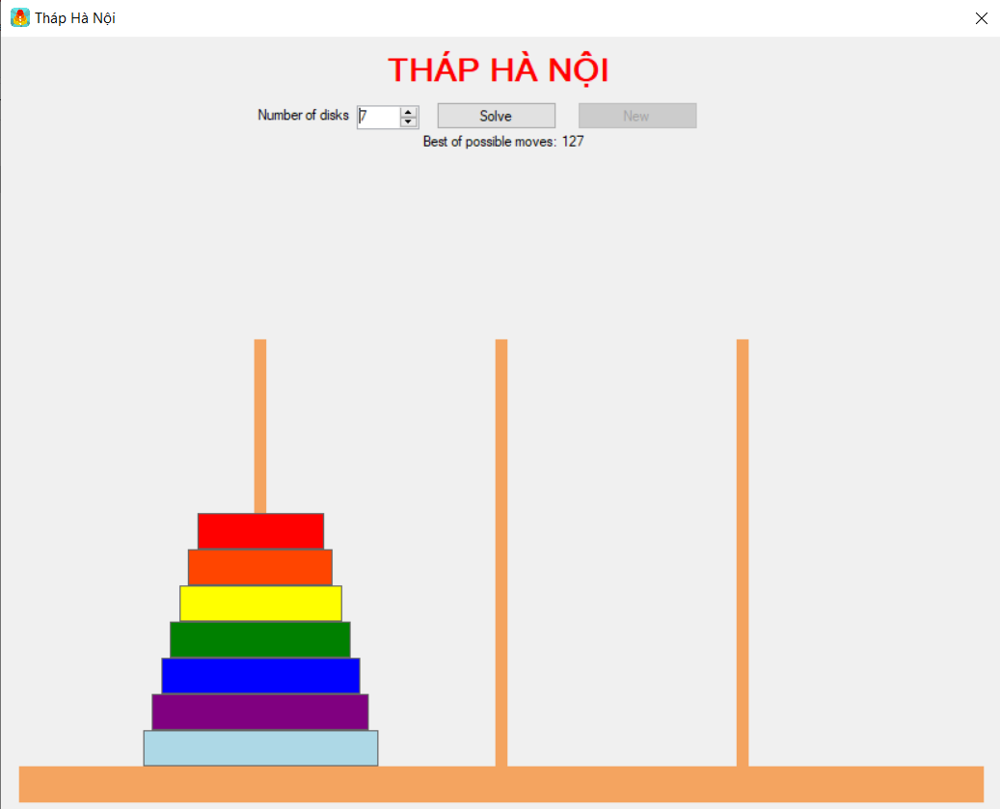

# Tháp Hà Nội
> Trò chơi bắt đầu bằng cách sắp xếp các đĩa theo trật tự kích thước vào một cọc sao cho đĩa nhỏ nhất nằm trên cùng, tức là tạo ra một dạng hình nón. Yêu cầu của trò chơi là di chuyển toàn bộ số đĩa sang một cọc khác, tuân theo các quy tắc sau:
 - Chỉ có 3 cột để di chuyển.
 - Một lần chỉ được di chuyển một đĩa (không được di chuyển đĩa nằm giữa).
 - Một đĩa chỉ có thể được đặt lên một đĩa lớn hơn (không nhất thiết hai đĩa này phải có kích thước liền kề, tức là đĩa nhỏ nhất có thể nằm trên đĩa lớn nhất).
 > Link: https://www.youtube.com/watch?v=RcgxxQS7LkM
 

